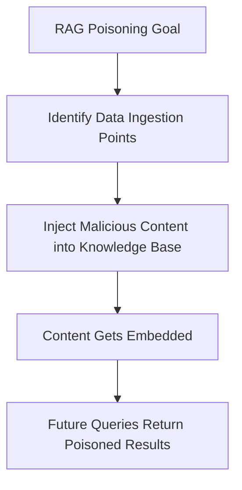

## Overview

Generative AI applications use Large Language Models (LLMs) to generate content, answer questions, or assist users. STRIDE GPT provides specialized threat modeling for GenAI systems by integrating the **OWASP Top 10 for LLM Applications (2025)** with traditional STRIDE methodology.

<Info>
Select "Generative AI application" in STRIDE GPT when your system:
- Uses foundation models to generate text, code, or other content
- Implements RAG (Retrieval-Augmented Generation) for knowledge grounding
- Provides conversational interfaces (chatbots, assistants)
- Processes user prompts without autonomous tool execution
</Info>

## OWASP LLM Top 10 Coverage

STRIDE GPT analyzes each threat through both traditional STRIDE categories and LLM-specific vulnerabilities:

### LLM01: Prompt Injection

<Accordion title="Threat Description">
Attackers craft inputs that override system prompts, manipulate model behavior, or bypass intended constraints. This can occur through:

- **Direct injection**: Malicious user prompts that override system instructions
- **Indirect injection**: Hidden instructions in documents, emails, or web content processed by the LLM
</Accordion>

<Accordion title="STRIDE Mapping">
- **Spoofing**: LLM impersonates other entities or users
- **Tampering**: Model behavior manipulated through crafted inputs
</Accordion>

<Accordion title="Example Scenario (from threat_model.py:79-86)">
```
Threat Type: Spoofing
Scenario: Attacker crafts inputs that override system prompts, making the LLM 
impersonate other entities or bypass intended behavior
Potential Impact: Users trust fraudulent communications leading to credential theft
OWASP LLM: LLM01
```
</Accordion>

### LLM02: Sensitive Information Disclosure

<Accordion title="Threat Description">
LLMs may inadvertently reveal:
- Training data containing PII or proprietary information
- Credentials or API keys from training corpus
- Confidential business information
- Personal data from fine-tuning datasets
</Accordion>

<Accordion title="STRIDE Mapping">
- **Information Disclosure**: LLM outputs expose sensitive data from training, fine-tuning, or RAG context
</Accordion>

<Accordion title="Example Scenario (from threat_model.py:385-390)">
```
Threat Type: Information Disclosure
Scenario: The LLM inadvertently reveals PII from its training data when users 
ask questions similar to training examples
Potential Impact: Privacy breach exposing customer personal information
OWASP LLM: LLM02
```
</Accordion>

### LLM03: Supply Chain Vulnerabilities

<Accordion title="Threat Description">
Compromised components in the LLM supply chain:
- Backdoored foundation models from untrusted sources
- Malicious plugins or extensions
- Poisoned model weights or adapters
- Compromised training pipelines
</Accordion>

<Accordion title="STRIDE Mapping">
- **Elevation of Privilege**: Compromised models/plugins introduce backdoors enabling unauthorized access
</Accordion>

<Accordion title="Example Threat">
```
Threat Type: Elevation of Privilege
Scenario: Application uses a fine-tuned model from an unverified third-party 
source containing a backdoor trigger that grants admin access when specific 
phrases are used
Potential Impact: Unauthorized access to administrative functions
OWASP LLM: LLM03
```
</Accordion>

### LLM04: Data and Model Poisoning

<Accordion title="Threat Description">
Malicious actors manipulate:
- **Training data**: Injecting biased or malicious examples into the training corpus
- **Fine-tuning data**: Poisoning domain-specific datasets
- **RAG embeddings**: Inserting malicious documents into vector stores
</Accordion>

<Accordion title="STRIDE Mapping">
- **Tampering**: Malicious modification of training data, fine-tuning data, or embeddings
- **Denial of Service**: Model performance degradation through poisoned data
</Accordion>

<Accordion title="RAG Poisoning Attack Path (from attack_tree.py:43-45)">

</Accordion>

### LLM05: Improper Output Handling

<Accordion title="Threat Description">
LLM outputs passed to downstream systems without validation enable:
- **Cross-Site Scripting (XSS)**: Malicious JavaScript in web responses
- **SQL Injection**: Unsanitized queries constructed from LLM output
- **Command Injection**: Shell commands built from generated content
- **SSRF**: URLs generated by LLM leading to internal network access
</Accordion>

<Accordion title="STRIDE Mapping">
- **Elevation of Privilege**: LLM output passed to downstream systems without validation enables injection attacks
</Accordion>

<Accordion title="Example Scenario (from threat_model.py:391-396)">
```
Threat Type: Elevation of Privilege
Scenario: LLM output containing user-controlled content is passed to a SQL 
query without sanitization, enabling SQL injection
Potential Impact: Database compromise and unauthorized data access
OWASP LLM: LLM05
```
</Accordion>

### LLM06: Excessive Agency

<Accordion title="Threat Description">
LLMs granted excessive permissions or autonomy:
- Overly broad tool access without least privilege
- Lack of human approval for sensitive actions
- Insufficient output validation before execution
</Accordion>

<Accordion title="STRIDE Mapping">
- **Elevation of Privilege**: LLM granted excessive permissions or autonomy to perform actions beyond intended scope
</Accordion>

<Note>
LLM06 is particularly critical for agentic AI applications. See the [Agentic AI](/ai-applications/agentic-ai) page for detailed coverage.
</Note>

### LLM07: System Prompt Leakage

<Accordion title="Threat Description">
Attackers extract system prompts to reveal:
- Business logic and decision-making rules
- API keys or credentials embedded in prompts
- Confidential instructions or guardrails
- Internal system architecture details
</Accordion>

<Accordion title="STRIDE Mapping">
- **Spoofing**: Extraction of system prompts reveals intended identity/behavior, enabling targeted spoofing
- **Information Disclosure**: Exposure of confidential system instructions, business logic, or secrets embedded in prompts
</Accordion>

<Accordion title="Example Attack (from attack_tree.py:36-38)">
```
Goal: Extract training data, PII, or system prompts
Path 1: Probe model with targeted queries → Identify patterns → Extract information
Path 2: Use prompt injection to reveal system prompt → Extract embedded credentials
```
</Accordion>

### LLM08: Vector and Embedding Weaknesses

<Accordion title="Threat Description">
Vulnerabilities in RAG and embedding systems:
- **Adversarial embeddings**: Content designed to appear similar to target queries
- **Cross-tenant leakage**: Multi-tenant vector stores exposing data across tenants
- **Embedding inversion**: Reconstructing sensitive documents from embeddings
- **Retrieval manipulation**: Biasing results through metadata poisoning
</Accordion>

<Accordion title="STRIDE Mapping">
- **Tampering**: Manipulation of RAG data or embeddings to alter retrieval results
- **Information Disclosure**: Information leakage through embeddings or cross-tenant RAG data
</Accordion>

<Accordion title="Architectural Pattern Detection (from threat_model.py:134-139)">
When STRIDE GPT detects RAG patterns (mentions of "RAG", "vector database", "embeddings", "Pinecone", "Weaviate", etc.), it automatically generates threats including:

- Vector store poisoning (malicious documents injected)
- Embedding manipulation (adversarial content for retrieval)
- Cross-tenant data leakage
- Stale/poisoned index exploitation
</Accordion>

### LLM09: Misinformation

<Accordion title="Threat Description">
LLM hallucinations or false outputs causing harm:
- Fabricated facts presented as truth
- Incorrect medical, legal, or financial advice
- False attributions of quotes or actions
- Difficult to attribute accountability for AI-generated misinformation
</Accordion>

<Accordion title="STRIDE Mapping">
- **Repudiation**: LLM generates false information that users act upon; difficult to attribute accountability
</Accordion>

<Accordion title="Example Scenario">
```
Threat Type: Repudiation
Scenario: LLM generates incorrect financial advice that appears authoritative. 
User acts on advice and suffers financial loss. Accountability unclear.
Potential Impact: Financial harm, reputational damage, liability concerns
OWASP LLM: LLM09
```
</Accordion>

### LLM10: Unbounded Consumption

<Accordion title="Threat Description">
Resource exhaustion through:
- Expensive queries with large context windows
- Repeated requests causing cost amplification
- Complex prompts triggering expensive computations
- Recursive or self-referencing content generation
</Accordion>

<Accordion title="STRIDE Mapping">
- **Denial of Service**: Resource exhaustion through expensive queries, long contexts, or repeated requests
</Accordion>

<Accordion title="Attack Path (from attack_tree.py:58-60)">
```
Goal: Denial of service or cost amplification
Path 1: Craft complex prompts → Trigger expensive computations → Exhaust API quotas
Path 2: Recursive prompt loops → Self-referencing content → Infinite token consumption
```
</Accordion>

## RAG-Specific Threats

STRIDE GPT provides enhanced analysis for RAG (Retrieval-Augmented Generation) systems:

<Steps>
  <Step title="Automatic Detection">
    Mentions of RAG, vector databases, embeddings, or document ingestion trigger pattern-specific analysis
  </Step>
  <Step title="Vector Store Poisoning">
    Threats covering malicious document injection during ingestion or updates
  </Step>
  <Step title="Retrieval Manipulation">
    Adversarial content designed to surface in specific query contexts
  </Step>
  <Step title="Cross-Tenant Leakage">
    Multi-tenant RAG systems exposing data across tenant boundaries
  </Step>
  <Step title="Embedding Security">
    Risks of embedding inversion, metadata poisoning, and stale indices
  </Step>
</Steps>

## Improvement Suggestions for GenAI Applications

After generating a threat model, STRIDE GPT provides targeted suggestions (from threat_model.py:397-402):

<CardGroup cols={2}>
  <Card title="Input Validation" icon="filter">
    "Describe how user inputs are validated before being sent to the LLM"
  </Card>
  <Card title="Data Access" icon="database">
    "Clarify what sensitive data the LLM has access to via RAG or fine-tuning"
  </Card>
  <Card title="Output Sanitization" icon="shield-check">
    "Detail how LLM outputs are sanitized before use in downstream systems"
  </Card>
  <Card title="Resource Controls" icon="gauge-high">
    "Specify rate limiting and cost controls for LLM API usage"
  </Card>
</CardGroup>

## Best Practices for Comprehensive Threat Models

<Warning>
**Provide Complete Application Details**

For effective GenAI threat modeling, include:

- **LLM Provider**: OpenAI GPT-4, Anthropic Claude, fine-tuned Llama 3, etc.
- **Features Used**: RAG, function calling, code generation, embeddings
- **Data Sources**: Documents, databases, APIs, user uploads, web scraping
- **Output Usage**: Displayed to users, stored in database, executed as code, sent to external systems
- **Fine-tuning**: Whether you use base models or custom fine-tuned versions
- **Input Validation**: How user prompts are filtered or sanitized
</Warning>

<Steps>
  <Step title="Describe Your RAG Pipeline (if applicable)">
    Include vector database (Pinecone, Weaviate, ChromaDB), embedding model, chunking strategy, and retrieval approach
  </Step>
  <Step title="Specify Output Handling">
    How are LLM responses used? Displayed directly? Passed to SQL queries? Rendered in web pages? Executed as commands?
  </Step>
  <Step title="Document Data Flow">
    What sensitive data can the LLM access? What systems receive LLM outputs?
  </Step>
  <Step title="Include Rate Limits">
    Mention any rate limiting, cost controls, or circuit breakers implemented
  </Step>
</Steps>

## Example Threat Model Output

For a GenAI application, STRIDE GPT generates threats mapped to both STRIDE and OWASP LLM categories:

```markdown
## Threat Model

| Threat Type | Scenario | Potential Impact | OWASP LLM |
|-------------|----------|------------------|------------|
| Tampering | Attacker injects malicious instructions through user-uploaded documents processed by the RAG system | Users make poor decisions based on manipulated LLM outputs | LLM01 |
| Information Disclosure | The LLM reveals fragments of its system prompt containing API keys when users craft specific queries | Exposure of credentials enables unauthorized access to backend services | LLM07 |
| Denial of Service | Attacker submits extremely long documents to the RAG ingestion pipeline, exhausting embedding API quotas | Service unavailable for legitimate users, significant cost overruns | LLM10 |
| Elevation of Privilege | LLM output containing SQL syntax is passed to database query without parameterization | Database compromise, unauthorized data access, potential data exfiltration | LLM05 |
```

## Cross-Layer Attack Scenarios

STRIDE GPT identifies attack chains spanning multiple system layers:

<Info>
**Example: RAG Poisoning → Prompt Injection → Data Exfiltration**

1. **Data Layer**: Attacker uploads malicious document to knowledge base
2. **Retrieval Layer**: Document embedded and indexed in vector store
3. **Foundation Model Layer**: User query retrieves poisoned content, injecting hidden instructions
4. **Application Layer**: LLM output includes data exfiltration payload
5. **Impact**: Sensitive data transmitted to attacker-controlled endpoint

This attack chain demonstrates how GenAI systems have expanded attack surfaces requiring defense-in-depth.
</Info>

## Next Steps

<CardGroup cols={2}>
  <Card title="Agentic AI Threats" icon="robot" href="/ai-applications/agentic-ai">
    Explore threats specific to autonomous agents with tool access
  </Card>
  <Card title="OWASP Mapping" icon="shield-halved" href="/ai-applications/owasp-integration">
    Understand how LLM threats integrate with STRIDE methodology
  </Card>
  <Card title="Back to Overview" icon="arrow-left" href="/ai-applications/overview">
    Return to AI applications overview
  </Card>
</CardGroup>