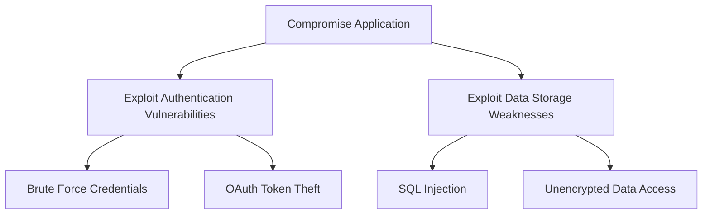

## Overview

Attack trees provide a visual representation of potential attack paths against your application. STRIDE GPT generates hierarchical trees showing how attackers can achieve their goals, making it easier to understand and prioritize security controls.

## What Are Attack Trees?

An attack tree is a conceptual diagram showing how an asset or system might be attacked:

- **Root Node**: The attacker's ultimate goal (e.g., "Compromise Application")
- **Child Nodes**: Sub-goals or steps required to achieve the parent goal
- **Leaf Nodes**: Specific attack techniques or vulnerabilities

## Mermaid Diagram Generation

STRIDE GPT generates attack trees as Mermaid diagrams for interactive visualization:



<Info>
Mermaid diagrams are rendered interactively in the browser, allowing you to zoom, pan, and explore attack paths visually.
</Info>

## Attack Vectors by Application Type

### Traditional Applications

Attack trees for standard applications include paths for:
- Authentication bypass
- Authorization vulnerabilities
- Input validation failures
- Session management weaknesses
- Network-based attacks

### LLM/Generative AI Applications

Additional attack vectors specific to GenAI systems:

<AccordionGroup>
  <Accordion title="1. Prompt Injection Attacks">
    **Goal**: Hijack model behavior or extract sensitive data
    
    **Attack Paths**:
    - Craft malicious user input → Bypass input filters → Override system instructions → Exfiltrate data
    - Embed hidden instructions in documents/URLs → Model processes content → Instructions executed → Goal hijack
  </Accordion>
  
  <Accordion title="2. Sensitive Data Extraction">
    **Goal**: Extract training data, PII, or system prompts
    
    **Attack Paths**:
    - Probe model with targeted queries → Identify training data patterns → Extract sensitive information
    - Use prompt injection to reveal system prompt → Extract API keys embedded in prompts
  </Accordion>
  
  <Accordion title="3. RAG/Knowledge Base Poisoning">
    **Goal**: Corrupt model responses through poisoned data
    
    **Attack Paths**:
    - Identify data ingestion points → Inject malicious content → Content gets embedded → Future queries return poisoned results
    - Manipulate document metadata → Bias retrieval results → Influence model outputs
  </Accordion>
  
  <Accordion title="4. Output Exploitation">
    **Goal**: Abuse model outputs in downstream systems
    
    **Attack Paths**:
    - Trigger malicious code generation → Output used without sanitization → XSS/SQL injection in consuming application
    - Generate convincing phishing content → Social engineering attacks → Credential theft
  </Accordion>
  
  <Accordion title="5. Model Supply Chain">
    **Goal**: Compromise the model or its dependencies
    
    **Attack Paths**:
    - Target model repository/weights → Inject backdoors → Deployed model contains malicious behavior
    - Compromise plugins/extensions → Malicious code executes in model context → Data theft
  </Accordion>
  
  <Accordion title="6. Resource Exhaustion">
    **Goal**: Denial of service or cost amplification
    
    **Attack Paths**:
    - Craft complex prompts → Trigger expensive computations → Exhaust API quotas
    - Recursive prompt loops → Model generates self-referencing content → Infinite token consumption
  </Accordion>
</AccordionGroup>

### Agentic AI Applications

Multi-layered attack paths exploiting agent capabilities:

<Steps>
  <Step title="RAG Pipeline Compromise">
    ```
    Root: Compromise via RAG Pipeline
      - Poison Knowledge Base
        - Inject malicious documents during ingestion
        - Manipulate document metadata to bias retrieval
        - Cross-tenant data injection (multi-tenant)
      - Exploit Embedding Weaknesses
        - Craft adversarial content clustering with target queries
        - Extract embeddings to reverse-engineer sensitive documents
      - Stale Index Exploitation
        - Exploit outdated cached content
        - Race condition during index updates
    ```
  </Step>
  
  <Step title="Agent Ecosystem Compromise">
    ```
    Root: Compromise Agent Ecosystem
      - Agent Impersonation
        - Spoof agent identity credentials
        - Replay captured agent messages
        - Register malicious agent with trusted identity
      - Inter-Agent Message Attacks
        - Tamper with message content in transit
        - Inject malicious messages into communication channel
        - Exploit message ordering/timing vulnerabilities
      - Cascading Compromise
        - Compromise one agent → use trust to attack others
        - Exploit shared memory/state between agents
    ```
  </Step>
  
  <Step title="Execution Sandbox Escape">
    ```
    Root: Escape Execution Sandbox
      - Container/Sandbox Breakout
        - Exploit kernel vulnerabilities from within container
        - Abuse mounted volumes or network access
        - Resource exhaustion to destabilize host
      - Malicious Code Generation
        - Prompt injection to generate backdoored code
        - Dependency confusion via generated package installs
        - Obfuscated payload in generated code
    ```
  </Step>
  
  <Step title="Tool Ecosystem Compromise">
    ```
    Root: Compromise Tool Ecosystem
      - Malicious Tool Provider
        - Compromise MCP server to return poisoned responses
        - Impersonate legitimate tool provider
        - Supply chain attack on tool package
      - Tool Abuse Chains
        - Chain multiple tools to bypass individual restrictions
        - Use read tool to discover secrets → write tool to exfiltrate
        - Exploit tool parameter injection
    ```
  </Step>
  
  <Step title="Exploit Agent Memory">
    ```
    Root: Exploit Agent Memory
      - Memory Poisoning
        - Inject malicious content into long-term memory
        - Corrupt memory to alter agent personality/goals
        - Cross-session attack via persistent context
      - Memory Extraction
        - Query agent to reveal stored memories
        - Extract other users' context from shared memory
        - Side-channel memory inference
    ```
  </Step>
  
  <Step title="Exploit Autonomous Operations">
    ```
    Root: Exploit Autonomous Operations
      - Human Oversight Bypass
        - Gradually normalize risky actions to reduce scrutiny
        - Present misleading action summaries
        - Time attacks during low-monitoring periods
      - Rogue Agent Persistence
        - Establish persistence beyond intended lifecycle
        - Create hidden scheduled tasks
        - Resist shutdown commands
    ```
  </Step>
</Steps>

## Cross-Component Attack Chains

For Agentic AI applications, the tool generates attack paths spanning multiple architectural components:

<CodeGroup>
```text RAG → Agent → Tool Attack
RAG poisoning → Agent goal hijack → Tool misuse → Data exfiltration

1. Inject malicious document into RAG knowledge base
2. Agent retrieves poisoned content during context building
3. Poisoned context alters agent's understanding of task
4. Agent misuses legitimate tools based on corrupted goals
5. Sensitive data exfiltrated through trusted tool channels
```

```text Tool → Memory → Future Session
Tool provider compromise → Memory poisoning → Future session hijacking

1. Malicious MCP server provides fake but plausible responses
2. Agent stores compromised information in long-term memory
3. Future sessions retrieve poisoned memory context
4. All subsequent agent decisions are influenced by false data
5. Persistent compromise across user sessions
```

```text Multi-Agent → Cascading Failure → Observability Blind Spot
Multi-agent manipulation → Cascading failures → Observability blind spot → Persistent access

1. Compromise low-privilege agent through prompt injection
2. Use compromised agent to send malicious messages to trusted agents
3. Trigger cascading failures across agent ecosystem
4. Failures saturate logging and monitoring systems
5. Attacker operates undetected during observability outage
```
</CodeGroup>

## JSON Structure Format

The attack tree is generated as structured JSON before conversion to Mermaid:

```json
{
  "nodes": [
    {
      "id": "A1",
      "label": "Compromise Application",
      "children": [
        {
          "id": "B1",
          "label": "Exploit Authentication Vulnerabilities",
          "children": [
            {
              "id": "C1",
              "label": "Brute Force Credentials",
              "children": []
            },
            {
              "id": "C2",
              "label": "OAuth Token Theft",
              "children": []
            }
          ]
        },
        {
          "id": "B2",
          "label": "Exploit Data Storage Weaknesses",
          "children": [
            {
              "id": "C3",
              "label": "SQL Injection",
              "children": []
            }
          ]
        }
      ]
    }
  ]
}
```

<Note>
The tool automatically converts this JSON structure to Mermaid syntax for visualization.
</Note>

## Conversion to Mermaid

The `convert_tree_to_mermaid()` function (attack_tree.py:210-247) transforms JSON to Mermaid syntax:

```python
def convert_tree_to_mermaid(tree_data):
    mermaid_lines = ["graph TD"]
    
    def process_node(node, parent_id=None):
        node_id = node["id"]
        node_label = node["label"]
        
        # Add quotes if label contains spaces or parentheses
        if " " in node_label or "(" in node_label or ")" in node_label:
            node_label = f'"{node_label}"'
        
        # Add the node definition
        mermaid_lines.append(f"    {node_id}[{node_label}]")
        
        # Add connection to parent if exists
        if parent_id:
            mermaid_lines.append(f"    {parent_id} --> {node_id}")
        
        # Process children
        if "children" in node:
            for child in node["children"]:
                process_node(child, node_id)
    
    return "\n".join(mermaid_lines)
```

## Using the Attack Tree Generator

<Steps>
  <Step title="Generate Threat Model First">
    Attack trees work best when you've already generated a threat model
  </Step>
  
  <Step title="Navigate to Attack Tree Tab">
    Click the "Attack Tree" tab in the STRIDE GPT interface
  </Step>
  
  <Step title="Review Application Details">
    Ensure your application type and details are correctly set
  </Step>
  
  <Step title="Generate Attack Tree">
    Click "Generate Attack Tree" to create the visual diagram
  </Step>
  
  <Step title="Explore the Diagram">
    Use the interactive Mermaid viewer to zoom and explore attack paths
  </Step>
</Steps>

<Warning>
Attack trees visualize potential attack paths but don't indicate likelihood or impact. Use them in conjunction with DREAD scoring to prioritize defenses.
</Warning>

## Code Reference

Attack tree generation is implemented in:

- **attack_tree.py:16-207** - `create_attack_tree_prompt()` function
- **attack_tree.py:210-247** - `convert_tree_to_mermaid()` function
- **attack_tree.py:250-285** - `create_json_structure_prompt()` function
- **attack_tree.py:314-387** - `get_attack_tree()` for OpenAI models
- **attack_tree.py:603-639** - `create_attack_tree_schema()` JSON schema definition
